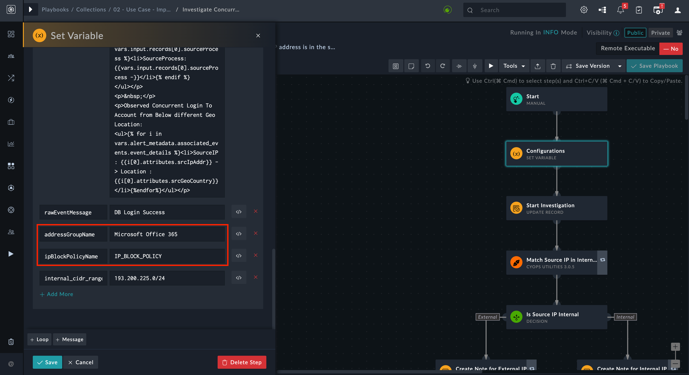

[Home](../README.md) |
|--------------------------------------------|

# Usage

Refer to [Simulate Scenario documentation](https://github.com/fortinet-fortisoar/solution-pack-soc-simulator/blob/develop/docs/usage.md) to understand how to simulate and reset scenarios.

To understand the process FortiSOAR follows to respond to phishing emails using Symantec Solutions, we have included a scenario &mdash; **Concurrent Successful Authentications** with this solution pack. Refer to the section *Concurrent Successful Authentications* to understand how this solution pack's automation addresses your needs.

## Concurrent Successful Authentications

This scenario generates an example alert of type **Concurrent Login** in FortiSOAR's **Alerts** module.

Navigate to the generated alert and note that source and destination IP addresses is present to analyze the case.

**Investigate Concurrent Login from Different Geo Location:**

Users can launch the **Investigate Concurrent Login from Different Geo Location** playbook from this alert. This playbook performs following automated tasks:

- Identify the geo location of the concurrent login
- Block the malicious Source IP Addresses on this Fortinet FortiGate firewall
- Get the user's details, who is attempting concurrent login, from Microsoft's Active Directory
- Check the user's login activity for the last 4 hours
- Disable the user for an hour with the IT team's approval
- Reset the user's password, if the user attempts to log in again

> **Note:** Please replace the names of the 'IP Block Policy' and 'Address Group' with the names configured on your FortiGate firewall in the 'Configuration' step of the "Investigate Concurrent Login from Different Geo Location" playbook.

# Next Steps
| [Installation](./setup.md#installation) | [Configuration](./setup.md#configuration) | [Contents](./contents.md) |
| ----------------------------------------- | ------------------------------------------- | --------------------------- |